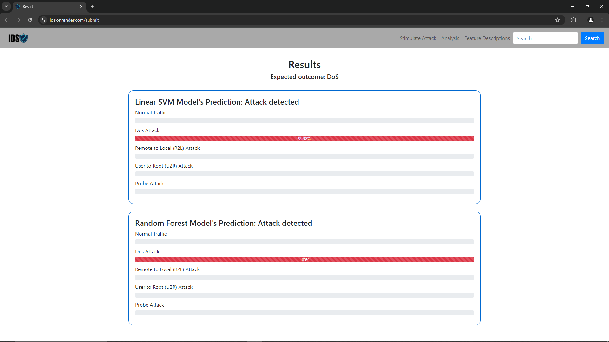
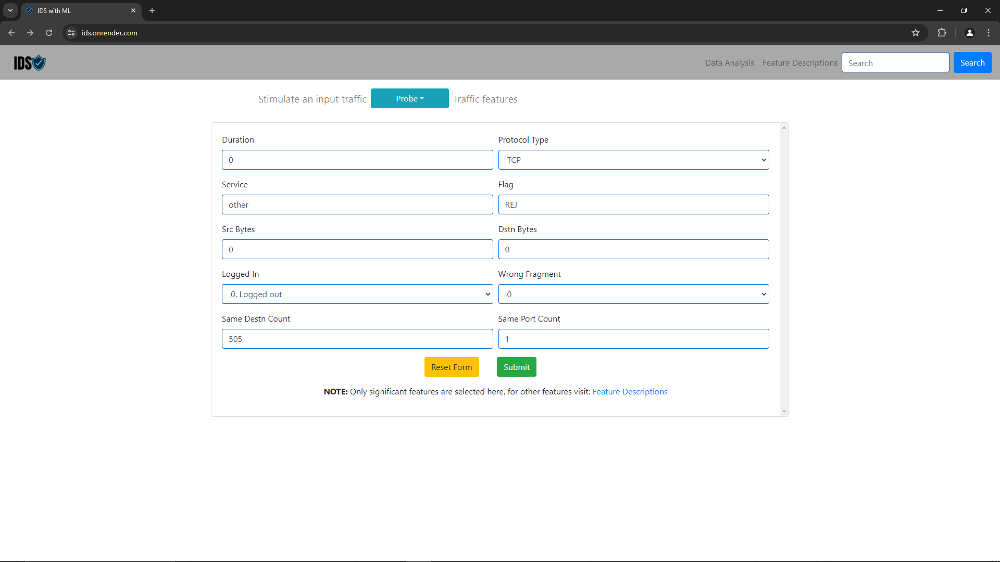
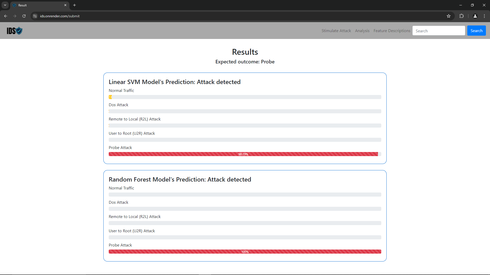
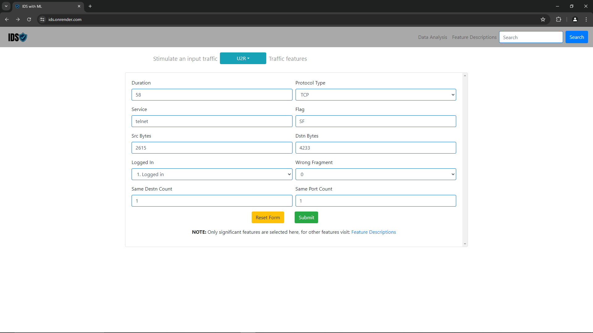
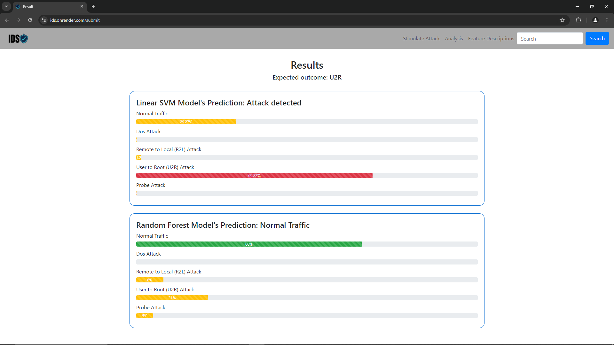
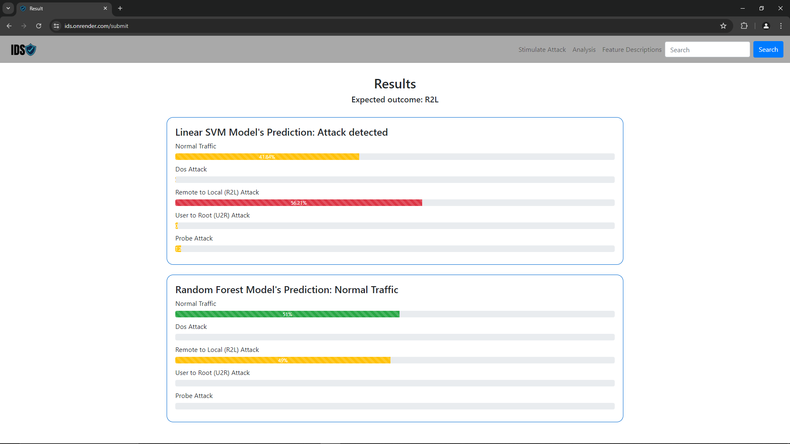
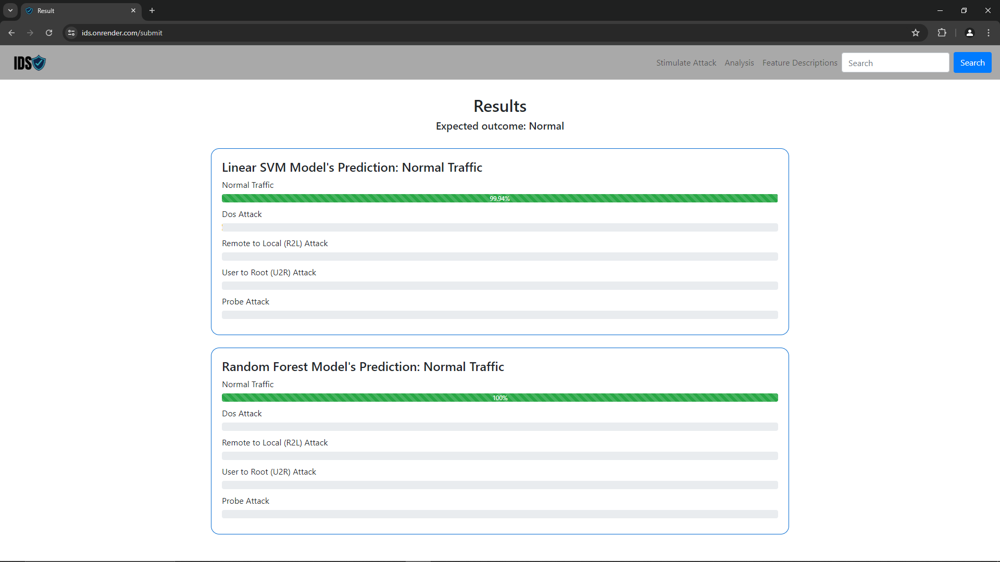

Designed and developed an intrusion detection web application using Python Flask. Integrated machine learning models based on Support Vector Machine (SVM) and Random Forest algorithms, trained on the KDD dataset.

## Screenshots

